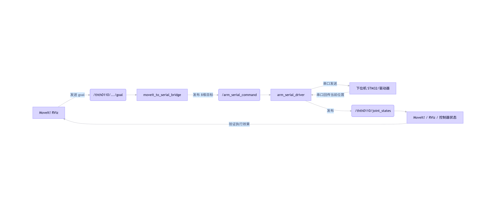

```sh
export GAZEBO_PLUGIN_PATH=${GAZEBO_PLUGIN_PATH}:~/Desktop/ARM/devel/lib
# 测试 action
rosrun rqt_joint_trajectory_controller rqt_joint_trajectory_controller
# 查看树
tree -L 4
# 查看端口
ls /dev/ttyACM* /dev/ttyUSB* /dev/ttyShaobing 
# 串口节点
catkin_make --pkg arm_serial_driver
roslaunch arm_serial_driver arm_serial_driver.launch
rostopic list
    /arm_serial_command
    /arm_serial_feedback
    /joint_states
    /rosout
    /rosout_agg
    /thth0110/arm_joint_controller/follow_joint_trajectory/goal
    /thth0110/gripper_joint_controller/follow_joint_trajectory/goal
# 测试串口
python src/arm_serial_driver/scripts/test_arm_command.py
rostopic echo /arm_serial_command
rostopic echo /thth0110/arm_joint_controller/follow_joint_trajectory/goal
rostopic echo /thth0110/gripper_joint_controller/follow_joint_trajectory/goal
# 清理所有 ROS 节点
rosnode kill -a
```


| 类型 | 名称 | 说明 |
|------|------|------|
| 节点 | `/arm_serial_driver` | 串口驱动主节点 |
| 订阅 | `arm_serial_command` | 接收目标位置指令 |
| 发布 | `arm_serial_feedback` | 发送原始反馈数据 |
| 发布 | `joint_states` | 发送标准关节状态（供可视化/监控） |

## 这些是 move_group 节点提供的 /execute_trajectory Action，用于接收完整轨迹并协调底层控制器执行。
它本身不直接驱动硬件，而是转发给你在 controllers.yaml 中定义的真实控制器（比如你的 /thth0110/arm_joint_controller/follow_joint_trajectory）。
| 层级 | 作用 |
|------|------|
| 高层：`/execute_trajectory` | 接收完整轨迹（可能包含多个 controllers）<br>例如：同时控制 arm + gripper |
| 底层：`/xxx/follow_joint_trajectory` | 实际执行某个 controller 的轨迹<br>例如：只控制 j1～j7 |

| 场景 | 行为 |
|------|------|
| 上电 | 读取当前位置 → 保持不动 |
| 不运行 MoveIt | 持续发送当前位置（不归零） |
| 运行 MoveIt | 正常跟踪轨迹 |
| MoveIt 停止 | 保持最后一个目标位置 |
✅ 三个规划组独立控制（j1–j7 / j6 / j8）
✅ 未涉及关节保持原值（不归零）
✅ 上电后自动从 /joint_states 初始化 command_，实现“上电即保持当前位置”

|框图|
|--|
||